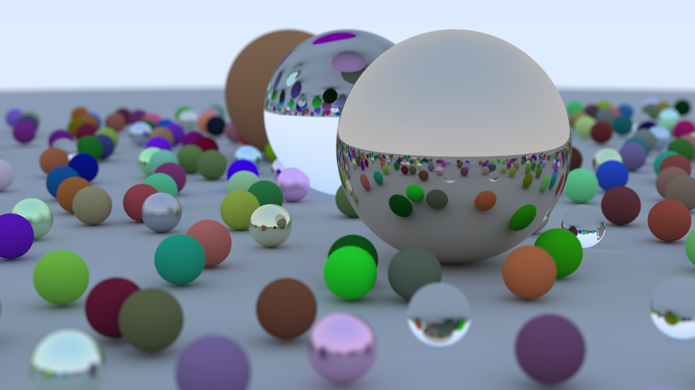
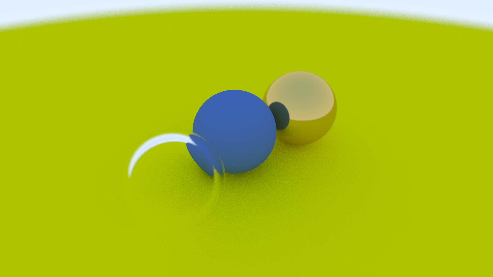

<div align="center">

# Ray Tracer

A simple, multithreaded CPU ray tracer.

</div>

## Renders
<p align="center">
  
  
</p>

## Features

- Renders built-in demo scenes with spheres and triangles
- Loads STL files and renders them as triangle meshes
- Supports multithreaded rendering for faster output

## Quickstart

If you do not want to build from source, you can use the prebuilt binaries provided in the GitHub [Releases](https://github.com/Karlito05/Ray-Tracer/releases/tag/latest) section for your platform.

## Building from source

The project uses CMake.

```bash
cmake -B build
cmake --build build
```

This will produce the RayTracer executable in the `build` directory.

### Cross-compiling for Windows

If you have a MinGW-w64 toolchain installed, you can build a Windows executable from Linux with:

```bash
cmake -B build-windows \
	-DCMAKE_TOOLCHAIN_FILE=cmake/toolchains/mingw-w64.cmake \
	-DCMAKE_BUILD_TYPE=Release
cmake --build build-windows
```

The output will be a Windows `.exe` in the chosen `build-windows` directory.

## Usage

Run the program with:

```bash
./RayTracer
```

Or with

```bash
./RayTracer --help
```
to display the help message

### Built-in scenes

If you run the program without the -p parameter, it will prompt you to choose one of the built-in scenes.

### Rendering an STL file

To render a mesh from an STL file:

```bash
./RayTracer -p model.stl
```

### Possible options

- -t, --threads: number of threads to use
- -w, --width: output image width (height will be calculated always in the aspect ratio of 16:9)
- -s, --samples_per_pixel: antialiasing samples per pixel
- -d, --depth: maximum ray bounce depth
- -p, --path: path to an STL file
- -o, --offset: camera distance offset for STL rendering
- -f, --fov: camera field of view

Example:

```bash
./RayTracer -p model.stl -w 1600 -s 64 -d 50 -t 8 -f 60
```

## How to export the STL file right

Exported STL files must use the coordinate convention Up = Y and Forward = -Z. This renderer assumes that orientation when reading triangle data, so meshes exported with a different axis convention may appear rotated or misplaced.

If you are exporting from Blender, make sure the export settings match:

- Up: Y
- Forward: -Z

## Output

The rendered image is written to Render.ppm in the working directory.

## Credits

Most of the concepts in this project are from a book called [Ray Tracing in a Weekend](https://raytracing.github.io/).

CLI parameters are parsed with a header library called [Popl](https://github.com/badaix/popl).
